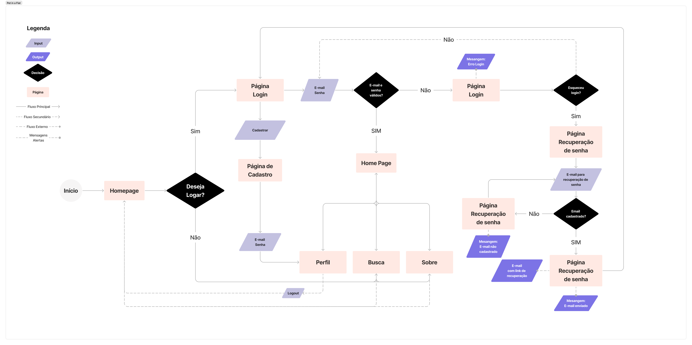
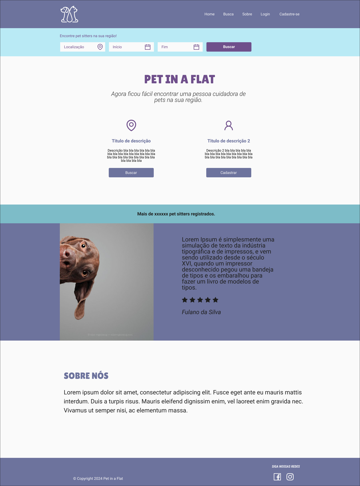
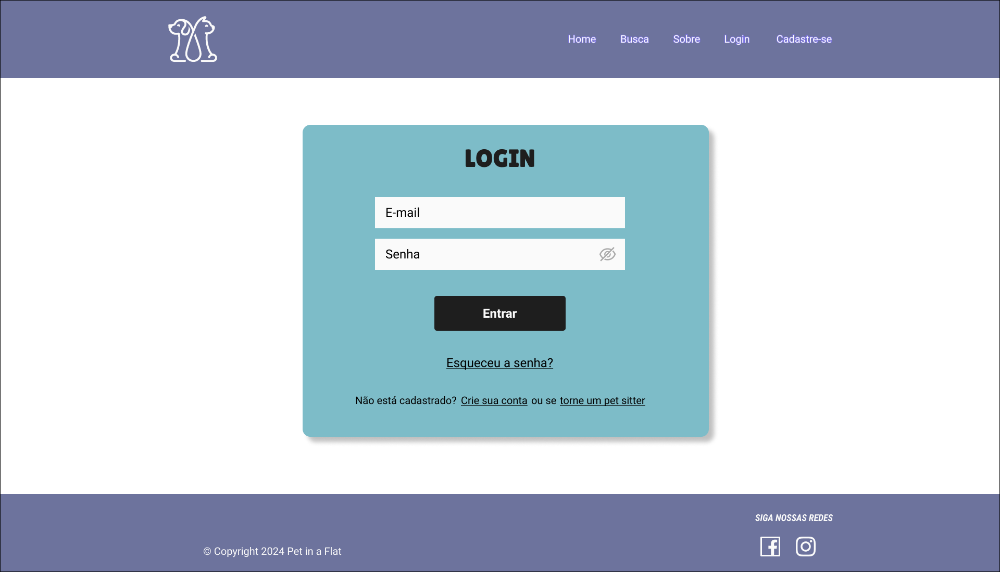
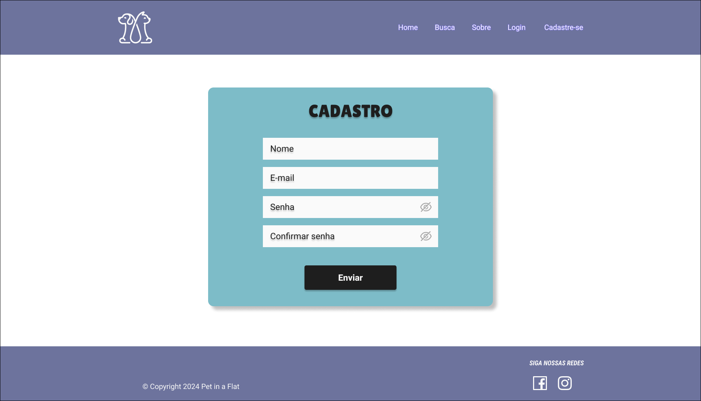
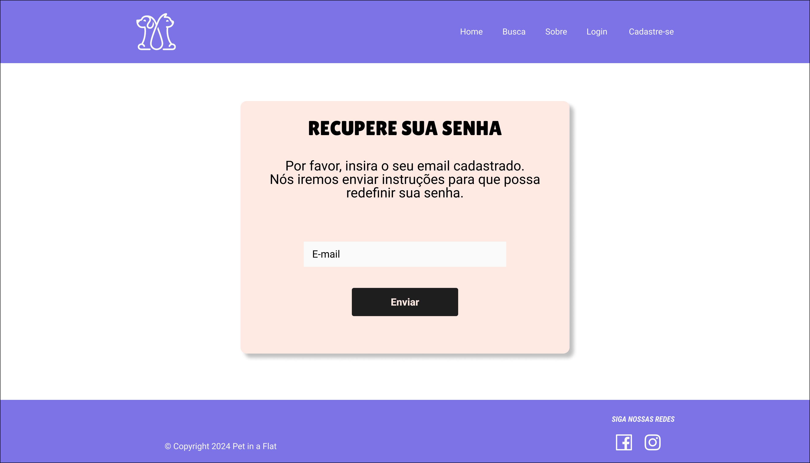
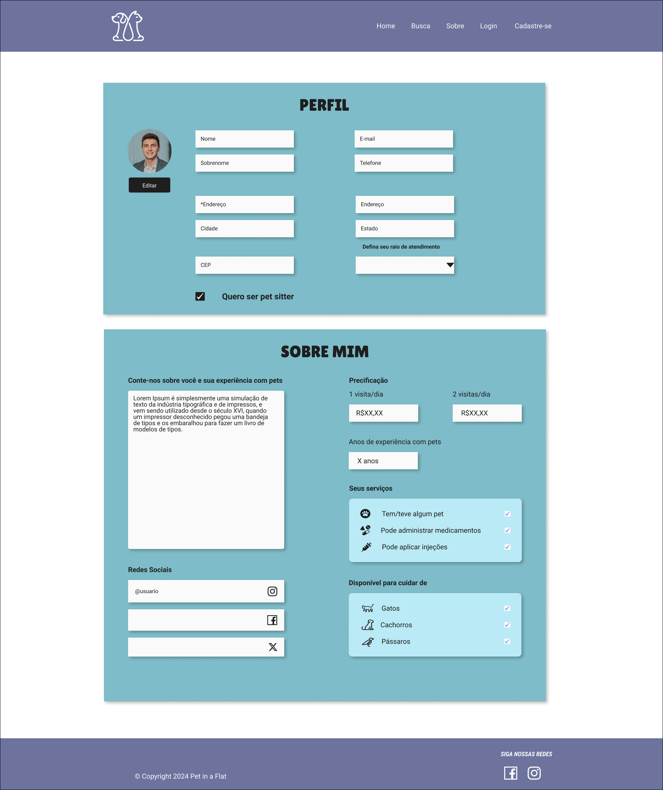
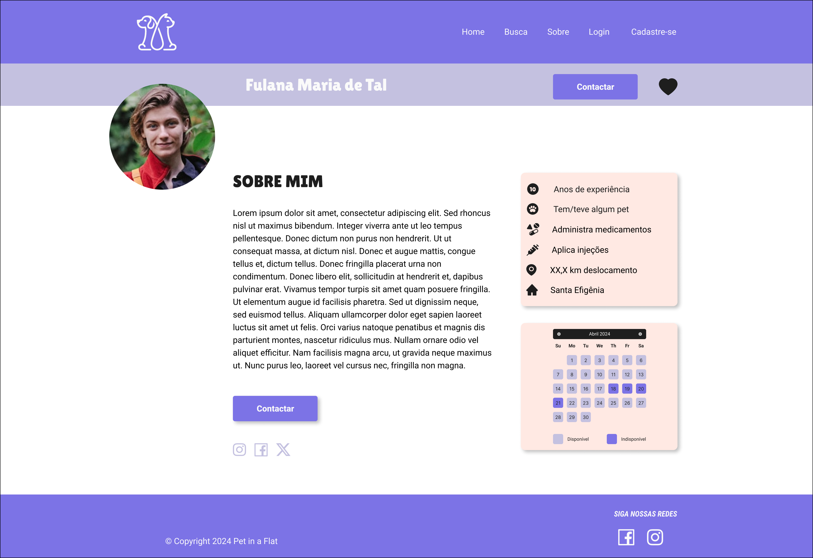
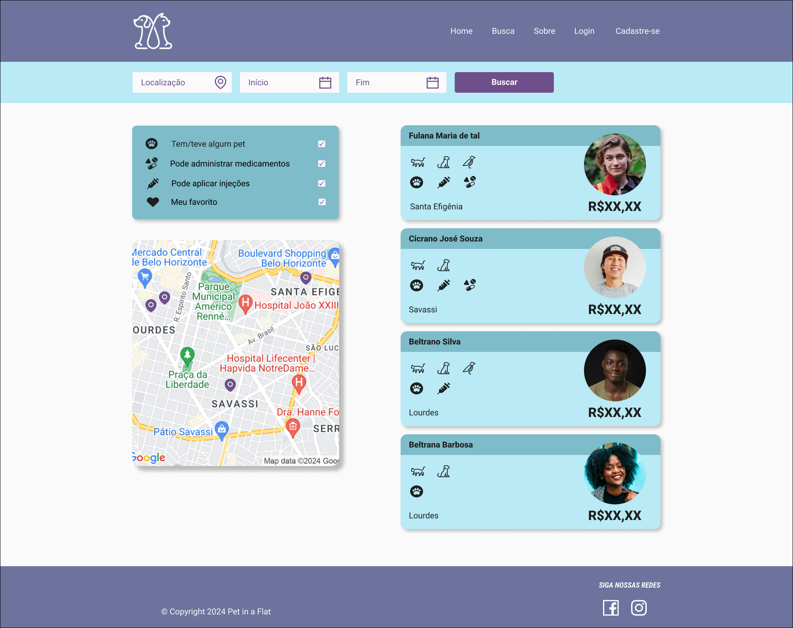
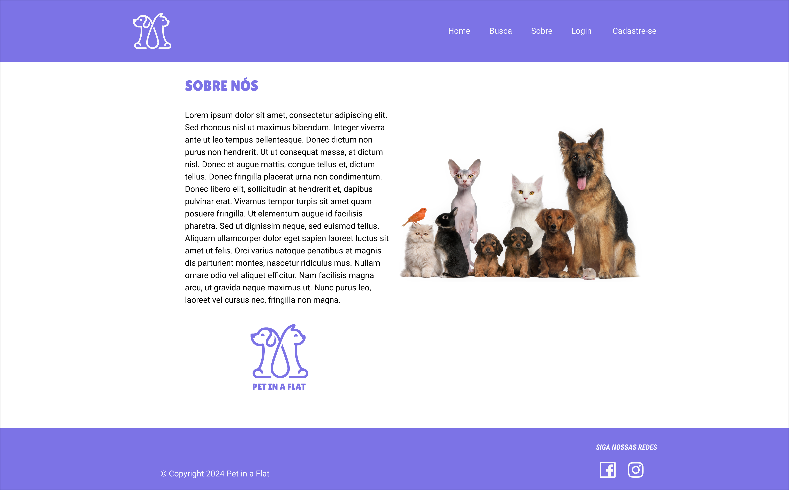

# Projeto de Interface

## User Flow

O User Flow, é uma estratégia que possibilita ao programador visualizar todo o percurso de navegação do usuário dentro do aplicação. Essa abordagem é eficaz para alinhar os trajetos e as diversas ações que o usuário pode realizar em conjunto com os colegas de trabalho.

<figure>
  Figura 1 - User Flow
</figure>

### Protótipo de baixa fidelidade

As páginas da aplicação possuem uma estrutura padrão conforme descrito abaixo:
<ul>
  <li>Cabeçalho - Exibe o logo da aplicação web e os links de navegação dentro do site;</li>
  <li>Conteúdo - Mostra o conteúdo da página em questão ao usuário;</li>
  <li>Rodapé - Exibe informações sobre direitos autorais e as rede sociais da Pet in a Flat.</li>
</ul>

 <figure>
  Figura 2 - Estrutura do site
</figure>

### Página - Homepage

A _Homepage_ apresenta ao usuário o que é o Pet in a Flat, o campo de busca, depoimentos de outros usuários, login e cadastro e Uma breve visão sobre nós.

<figure>
  Figura 3 - Homepage
</figure>

### Página - Login

A página _Login_ apresenta os campos de e-mail e senha e informações caso o usuário tenha esquecido sua senha ou ainda não seja cadastrado.

<figure>
  Figura 4 - Página de login
</figure>

### Página - Cadastro

A página _Cadastro_ apresenta os campos de nome, e-mail e senha para os usuários que desejam se cadastrar na plataforma.

<figure>
  Figura 5 - Página de cadastro
</figure>

### Página - Recuperação de senha

A página _Recuperação de senha_ informa como o usuário fará para recuperar seu acesso caso ele tenha perdido.

<figure>
  Figura 6 - Página de recuperação de senha
</figure>

### Página - Editar Perfil

A página de _Editar Perfil_ mostra todas as informações necessárias que o usuário preencha para poder utilizar a plataforma corretamente.

<figure>
  Figura 7 - Página de edição do perfil
</figure>

### Página - Perfil

A página _Perfil_ mostra as informações preenchidas na página de edição perfil de forma consolidada e a agenda de disponibilidade para os serviços.

<figure>
  Figura 8 - Página de perfil
</figure>

### Página - Busca

A página _Busca_ é onde os usuários e visitantes poderão localizar os pet sitters cadastrados na plataforma, mostrando sua localização e informações úteis para a contratação do serviço.

<figure>
  Figura 9 - Página de busca
</figure>

### Página - Sobre

A página _Sobre Nós_ descreve mais detalhadamente sobre o projeto Pet in a flat.

<figure>
  Figura 9 - Página sobre a empresa Pet in a Flat
</figure>

