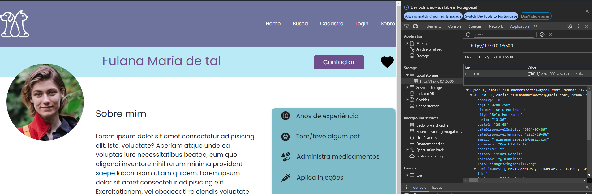
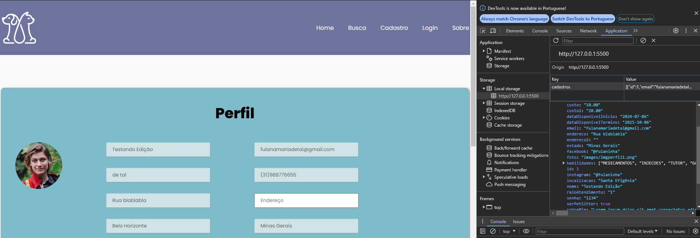

# Registro de Testes de Software

Relatório com as evidências dos testes de software realizados na aplicação pela equipe, baseado no plano de testes pré-definido.

Os resultados dos testes funcionais realizados na aplicação são descritos a seguir.

#### Caso de Teste: CT-01 - Verificar a funcionalidade do formulário de busca

| Caso de Teste    | CT-01 - Verificar a funcionalidade do formulário de busca |
|:---|:---|
| Resultados obtidos | O teste foi bem-sucedido. O formulário de busca permite a inserção da localização desejada e mostra os resultados encontrados caso existam registros de pet sitters na referida localização. O usuário também consegue listar pet sitters de acordo com a disponibilidade de datas desses profissionais. |
| Responsável pela execução do caso de Teste | Ana Cavalcanti |

#### Caso de Teste: CT-02 - Verificar a funcionalidade de filtragem de busca

| Caso de Teste    | CT-02 - Verificar a funcionalidade de filtragem de busca |
|:---|:---|
| Resultados obtidos | O teste foi bem-sucedido. A partir da seleção de uma ou mais checkboxes é possível listar pet sitters não apenas por localização e datas de disponibilidade, mas também por habilidades: experiência prévia com animais, saber administrar medicamentos, injeções e pet sitters favoritos. | Ana Cavalcanti |

#### Caso de Teste: CT-03 - Verificar a funcionalidade de cadastro de usuário

| Caso de Teste    | CT-03 - Verificar a funcionalidade de cadastro de usuário |
|:---|:---|
| Resultados obtidos | O teste foi bem-sucedido. O formulário de cadastro permitiu a inserção de dados e a criação de um novo usuário. Após a submissão, uma mensagem de sucesso foi exibida e o usuário foi redirecionado para a página de login. |
| Responsável pela execução do caso de Teste | Grace Kelly |

#### Caso de Teste: CT-04 - Verificar validação de senhas e preenchimento completo no cadastro de usuário

| Caso de Teste    | CT-04 - Verificar validação de senhas e preenchimento completo no cadastro de usuário |
|:---|:---|
| Resultados obtidos | O teste foi bem-sucedido. O sistema validou corretamente as senhas, exibindo uma mensagem de erro quando as senhas não coincidiam e impedindo o cadastro até que as senhas fossem iguais e todos os campos estivessem preenchidos. |
| Responsável pela execução do caso de Teste | Grace Kelly |

#### Caso de Teste: CT-05 - Verificar cadastro com e-mail já existente

| Caso de Teste    | CT-05 - Verificar cadastro com e-mail já existente |
|:---|:---|
| Resultados obtidos | O teste foi bem-sucedido. O sistema impediu o cadastro de um novo usuário utilizando um e-mail já existente, exibindo uma mensagem de erro. |
| Responsável pela execução do caso de Teste | Grace Kelly |

#### Caso de Teste: CT-06 - Verificar Login com e-mail e senha existente

| Caso de Teste    | CT-06 - Verificar Login com e-mail e senha existente |
|:---|:---|
| Resultados obtidos | O teste foi bem-sucedido. O sistema confirmou e-mail e senha do usuario, exibindo uma mensagem de Login realizado com sucesso!. |
| Responsável pela execução do caso de Teste | Felipe Soares Kutschera |

#### Caso de Teste: CT-07 - Verificar Login com e-mail e senha existente

| Caso de Teste    | CT-07 - Verificar Login com e-mail e senha existente |
|:---|:---|
| Resultados obtidos | O teste foi bem-sucedido. O sistema confirmou e-mail e senha do usuario, exibindo uma mensagem de E_mail ou senha incorretos!. |
| Responsável pela execução do caso de Teste | Felipe Soares Kutschera |

| Caso de Teste    | CT-08 - Verificar e-mail para recuperação de senha |
|:---|:---|
| Resultados obtidos | O teste foi bem-sucedido. O sistema confirmou e-mail, exibindo uma mensagem de E-mail enviado !. |
| Responsável pela execução do caso de Teste | Felipe Soares Kutschera |

| Caso de Teste    | CT-09 - Verificar e-mail para recuperação de senha |
|:---|:---|
| Resultados obtidos | O teste foi bem-sucedido. O sistema confirmou e-mail, exibindo uma mensagem de E-mail incorreto, por favor tente novamente !. |
| Responsável pela execução do caso de Teste | Felipe Soares Kutschera |

| Caso de Teste    | CT-10 - Verificar os dados mostrado no perfil é referenciado do banco de dados (localStorage) |
|:---|:---|
| Resultados obtidos | O teste foi bem-sucedido. Os dados na página e no localStorage são iguais. |
| Responsável pela execução do caso de Teste | Vinicius Sartini da Silva |

| Caso de Teste    | CT-11 - Verificar a edição dos dados do usuário cadastrado no banco de dados (localStorage) |
|:---|:---|
| Resultados obtidos | O teste foi bem-sucedido. Ao atualizar as informações e confirmar, os dados são atualizados no localStorage.|
| Responsável pela execução do caso de Teste | Vinicius Sartini da Silva |

