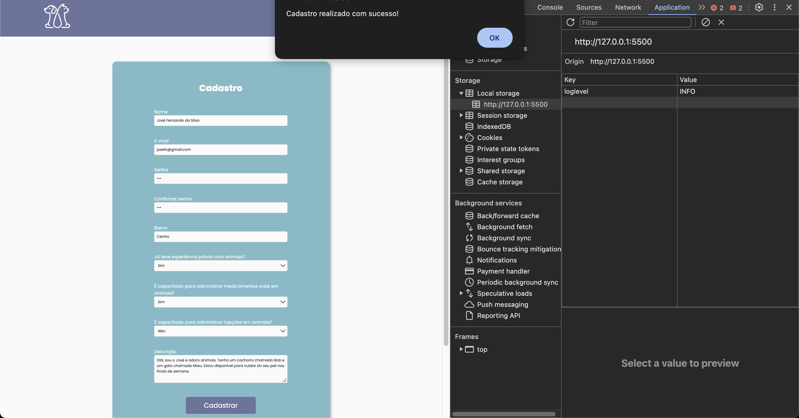
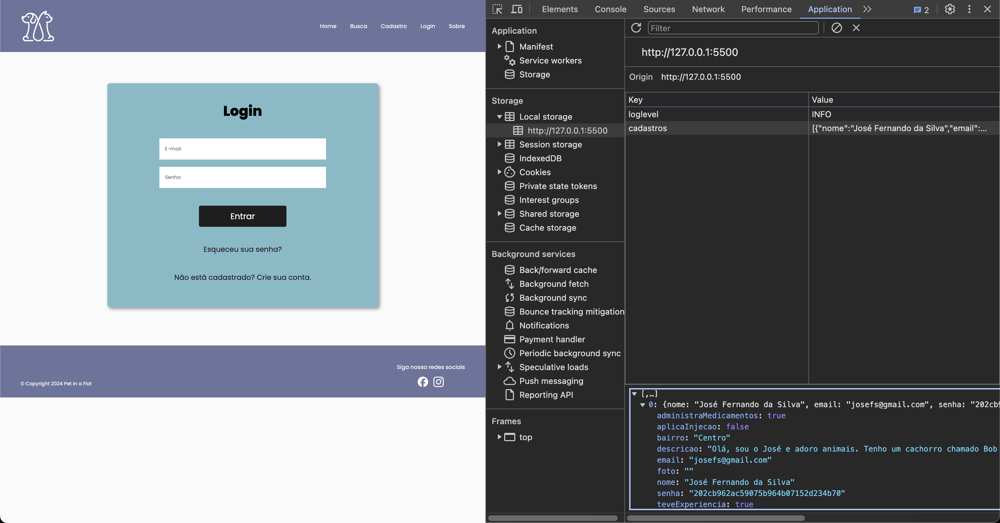
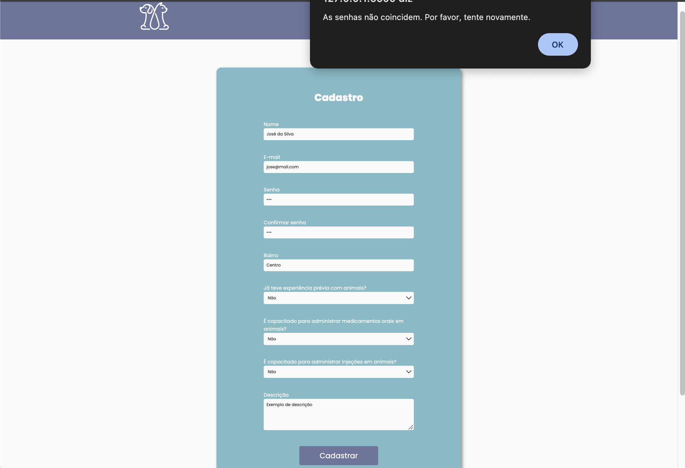
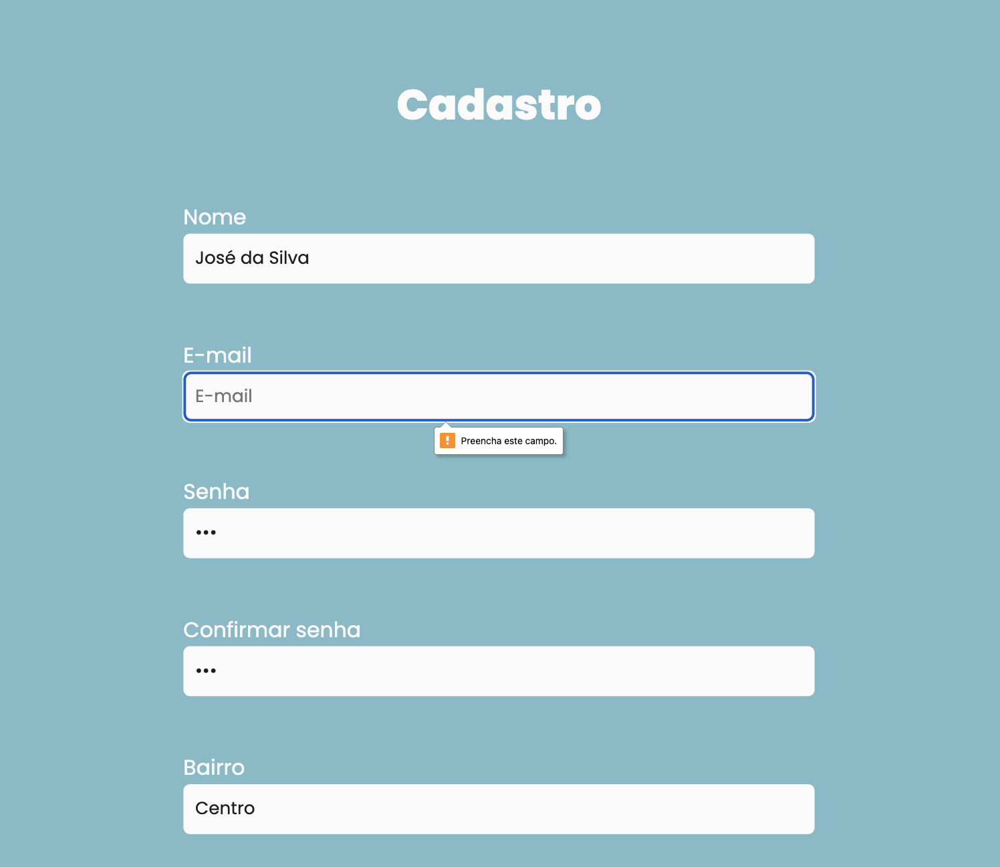
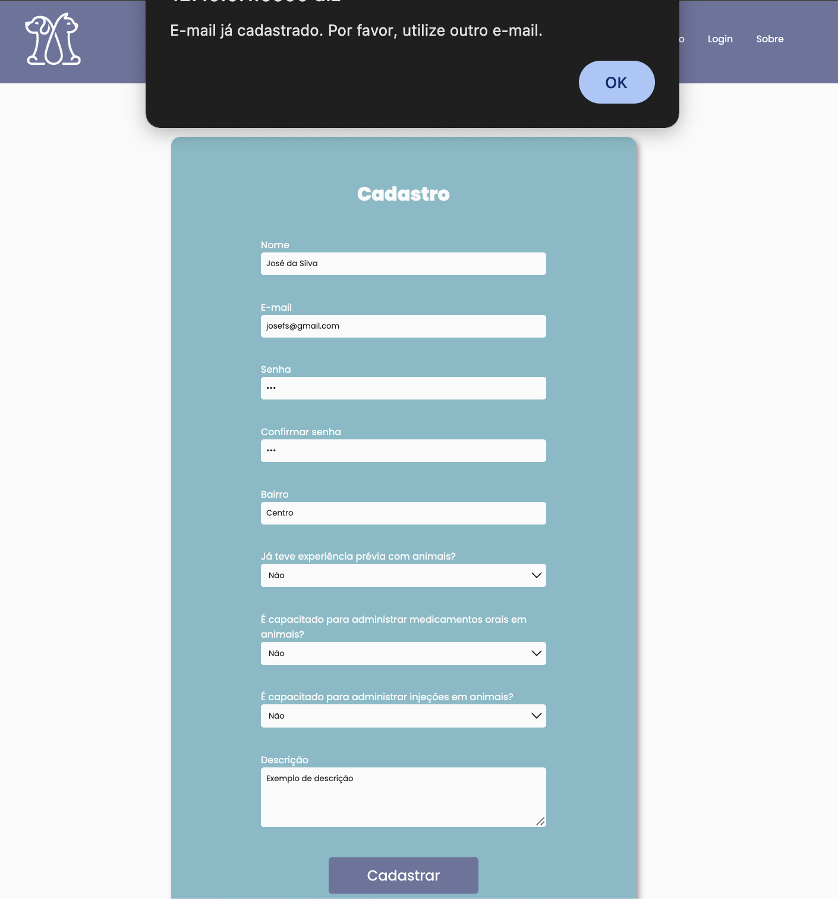

# Registro de Testes de Software

Relatório com as evidências dos testes de software realizados na aplicação pela equipe, baseado no plano de testes pré-definido.

Os resultados dos testes funcionais realizados na aplicação são descritos a seguir.

#### Caso de Teste: CT-01 - Verificar a funcionalidade do formulário de busca

| Caso de Teste    | CT-01 - Verificar a funcionalidade do formulário de busca |
|:---|:---|
| Resultados obtidos | O teste foi bem-sucedido. O formulário de busca permite a inserção da localização desejada e mostra os resultados encontrados caso existam registros de pet sitters na referida localização. O usuário também consegue listar pet sitters de acordo com a disponibilidade de datas desses profissionais. |
| Responsável pela execução do caso de Teste | Ana Cavalcanti |

#### Caso de Teste: CT-03 - Verificar a funcionalidade de cadastro de usuário

| Caso de Teste    | CT-03 - Verificar a funcionalidade de cadastro de usuário |
|:---|:---|
| Resultados obtidos | O teste foi bem-sucedido. O formulário de cadastro permitiu a inserção de dados e a criação de um novo usuário. Após a submissão, uma mensagem de sucesso foi exibida e o usuário foi redirecionado para a página de login. |
| Responsável pela execução do caso de Teste | Grace Kelly |

#### Caso de Teste: CT-04 - Verificar validação de senhas e preenchimento completo no cadastro de usuário

| Caso de Teste    | CT-04 - Verificar validação de senhas e preenchimento completo no cadastro de usuário |
|:---|:---|
| Resultados obtidos | O teste foi bem-sucedido. O sistema validou corretamente as senhas, exibindo uma mensagem de erro quando as senhas não coincidiam e impedindo o cadastro até que as senhas fossem iguais e todos os campos estivessem preenchidos. |
| Responsável pela execução do caso de Teste | Grace Kelly |

#### Caso de Teste: CT-05 - Verificar cadastro com e-mail já existente

| Caso de Teste    | CT-05 - Verificar cadastro com e-mail já existente |
|:---|:---|
| Resultados obtidos | O teste foi bem-sucedido. O sistema impediu o cadastro de um novo usuário utilizando um e-mail já existente, exibindo uma mensagem de erro. |
| Responsável pela execução do caso de Teste | Grace Kelly |

